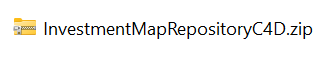
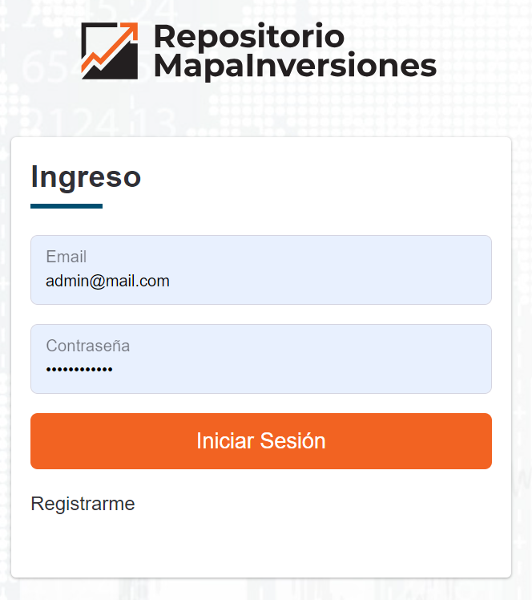

# Repositorio MapaInversiones
## Despliegue de la base de datos

---

Los siguientes son los pasos para lograr tener una base de datos funcional del Repositorio MapaInversiones. 

***

#### Descomprimir el Backup
Descomprimir el backup que se encuentra en formato zip.

***

#### Crear la base de datos
Crear una base de datos llamada InvestmentMapRepositoryC4D.

Si está usando Microsoft SQL Server Management Studio:
- En el lado izquierdo de la pantalla, clic derecho sobre Databases
- New Database…
- En Database name: InvestmentMapRepositoryC4D

***

#### Restaurar la base de datos
Restaurar la base de datos desde la copia de respaldo InvestmentMapRepositoryC4D.bak

Si está usando Microsoft SQL Server Management Studio:
- En el lado izquierdo de la pantalla, clic derecho sobre el nombre de la nueva base de datos (InvestmentMapRepositoryC4D)
- Dentro de la opción Tasks usar las opciones Restore y Database…

- Seleccionar el archivo de respaldo descomprimido.
-- Marcar la opción Device y usar el botón  para buscar el archivo de respaldo descomprimido y Ok.

-Verificar que esté seleccionada la base de datos InvestmentMapRepositoryC4D

***

#### Registrar la cadena de conexión en el código fuente del Sistema
Actualizar el código fuente para que utilice la base de datos que se instaló.
- En el archivo appsettings.json del código fuente registrar, la cadena de conexión

- En el archivo Program.cs del código fuente, poner el nombre de la nueva cadena de conexión.

***

#### Usuario pre-registrado de Administración del Sistema
La base de datos restaurada tiene un usuario del sistema de nivel administrador.
Lo primero que se debe hacer al instalar el sistema y la base de datos es ingresar al sistema con el usuario administrador pre-registrado y modificar la clave de acceso.

Información del usuario pre-registrado:

- Email: admin@mail.com
- Contraseña: 

Una vez modificada la contraseña se registra la información de las diferentes tablas de configuración para poder empezar a trabajar en los proyectos. Los nuevos usuarios deben registrarse en el sistema y luego ser autorizados por un administrador del sistema que les asigna su rol correspondiente.

